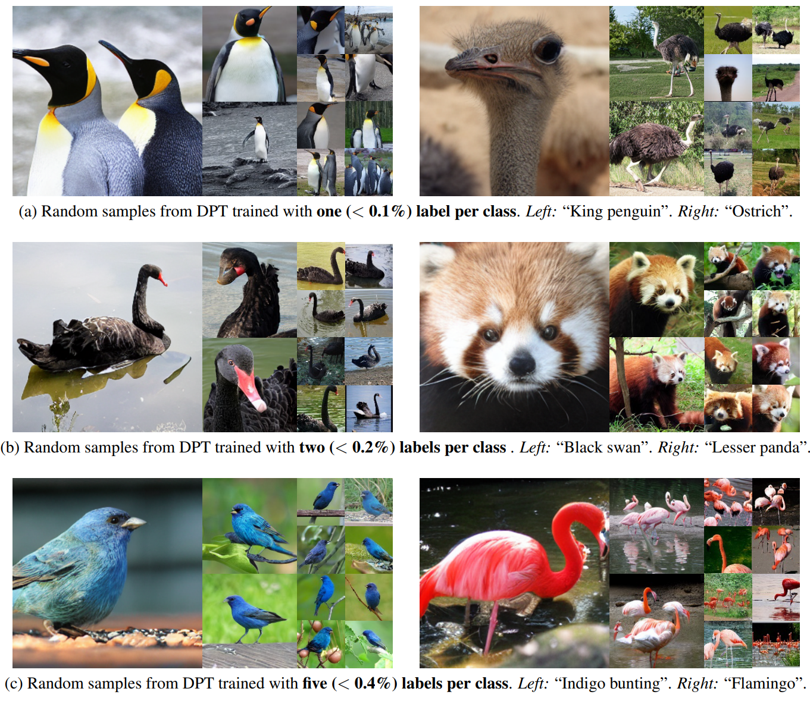

## [Diffusion Models and Semi-Supervised Learners Benefit Mutually with Few Labels](https://arxiv.org/abs/2302.10586)<br> <sub>Official Pytorch Implementation</sub>


We propose a three-stage training strategy called dual pseudo training (DPT) for conditional image generation and classification in semi-supervised learning. First, a classifier is trained on partially labeled data and predicts pseudo labels for all data. Second, a conditional generative model is trained on all data with pseudo labels and generates pseudo images given labels. Finally, the classifier is trained on real data augmented by pseudo images with labels. We demonstrate large-scale diffusion models and semi-supervised learners benefit mutually with a few labels via DPT. In particular, on the ImageNet 256x256 generation benchmark, DPT can generate realistic, diverse, and semantically correct images with very few labels. With two (i.e., < 0.2%) and five (i.e., < 0.4%) labels per class, DPT achieves an FID of 3.44 and 3.37 respectively, outperforming strong diffusion models with full labels, such as IDDPM, CDM, ADM, and LDM. Besides, DPT outperforms competitive semi-supervised baselines substantially on ImageNet classification benchmarks with one, two, and five labels per class, achieving state-of-the-art top-1 accuracies of 59.0 (+2.8), 69.5 (+3.0), and 73.6 (+1.2) respectively. See more in [Demo](https://ml-gsai.github.io/DPT-demo/).

--------------------


## Dependency

```sh
pip3 install torch torchvision torchaudio
pip install Cyanure accelerate ml_collections einops datasets tensorboard timm==0.3.2 absl-py ml_collections wandb ftfy==6.1.1 transformers==4.23.1 setuptools==58.0.4
```
* This repo is based on [`timm==0.3.2`](https://github.com/rwightman/pytorch-image-models), for which a [fix](https://github.com/rwightman/pytorch-image-models/issues/420#issuecomment-776459842) is needed to work with PyTorch 1.8.1+

## Data Preparation
### ImageNet data prepare
put the ImageNet-1k Datasets in `/cache/datasets/ILSVRC/Data/CLS-LOC` which contains the `train` and `val` folders.
you can also try to change the configs.root_path image_folder image_path in the configs file.

### Autoencoder
Download `stable-diffusion` directory from this [link](https://drive.google.com/drive/folders/1yo-XhqbPue3rp5P57j6QbA5QZx6KybvP?usp=sharing) (which contains image autoencoders converted from [Stable Diffusion](https://github.com/CompVis/stable-diffusion)). 
Put the downloaded directory as `assets/stable-diffusion` in this codebase.
The autoencoders are used in latent diffusion models.
### MSN pretrained model
Download msn pretrained model [ViT-B/4](https://dl.fbaipublicfiles.com/msn/vitb4_300ep.pth.tar) and [ViT-L/7](https://dl.fbaipublicfiles.com/msn/vitl7_200ep.pth.tar)
Put the downloaded directory as `pretrained` in this codebase.
### Fnames_num_dict.pth.tar
Download fnames_num_dict.pth.tar from this [link](https://drive.google.com/file/d/1zawEZZtEVjgy63RETjb891AcQOFtCKWl/view?usp=sharing) 
Put the downloaded file in this codebase.
### Evaluation
#### Reference statistics for FID
Download `fid_stats` directory from this [link](https://drive.google.com/drive/folders/1yo-XhqbPue3rp5P57j6QbA5QZx6KybvP?usp=sharing) (which contains reference statistics for FID).
Put the downloaded directory as `assets/fid_stats` in this codebase.

## Training
We use the [huggingface accelerate](https://github.com/huggingface/accelerate) library to help train with distributed data parallel and mixed precision. The following is the training command:
#### For single node with ViT-B/4 subsets1/2img K=128
```sh
# We provide all commands to reproduce DPT training in the paper:
## you can change the configs in the configs files to train other models. For our DPT, you can change subset_path, model_name, fname, augmentation_K to choose your model. We only list four files.
accelerate launch --multi_gpu --main_process_ip localhost --main_process_port 1234 --num_machines 1 --machine_rank 0 --num_processes 4 --mixed_precision fp16 train_classifier.py --config=configs/accelerate_b4_subset1_2img_k_128.py --config.output_path=log/stage1_log --func=train_classifier_stage1

accelerate launch --multi_gpu --main_process_ip localhost --main_process_port 1234 --num_machines 1 --machine_rank 0 --num_processes 4 --mixed_precision fp16 train_classifier.py --config=configs/accelerate_b4_subset1_2img_k_128.py --func=get_all_features

accelerate launch --multi_gpu --main_process_ip localhost --main_process_port 1234 --num_machines 1 --machine_rank 0 --num_processes 4 --mixed_precision fp16 train_classifier.py --config=configs/accelerate_b4_subset1_2img_k_128.py --func=get_cluster

python extract_imagenet_features_semi.py --config=configs/accelerate_b4_subset1_2img_k_128.py

accelerate launch --multi_gpu --main_process_ip localhost --main_process_port 1234 --num_machines 1 --machine_rank 0 --num_processes 4 --mixed_precision fp16 train_ldm.py --config=configs/accelerate_b4_subset1_2img_k_128.py 

accelerate launch --multi_gpu --main_process_ip localhost --main_process_port 1234 --num_machines 1 --machine_rank 0 --num_processes 4 --mixed_precision fp16 sample_ldm_all.py --config=configs/accelerate_b4_subset1_2img_k_128.py --output_path=log/sample_log

accelerate launch --multi_gpu --main_process_ip localhost --main_process_port 1234 --num_machines 1 --machine_rank 0 --num_processes 4 --mixed_precision fp16 train_classifier.py --config=configs/accelerate_b4_subset1_2img_k_128.py --func=get_aug_features

accelerate launch --multi_gpu --main_process_ip localhost --main_process_port 1234 --num_machines 1 --machine_rank 0 --num_processes 4 --mixed_precision fp16 train_classifier.py --config=configs/accelerate_b4_subset1_2img_k_128.py --func=train_classifier_stage3 --config.output_path=log/stage3_log
```
#### For multi node with ViT-B/4 subsets1/2img K=128
```sh
## change the accelerate main_process_ip main_process_port, num_machines, machine_rank, num_processes to your own settings.
### Step 1 
accelerate launch --multi_gpu --main_process_ip localhost --main_process_port 1234 --num_machines 4 --machine_rank 0 --num_processes 32 --mixed_precision fp16 train_classifier.py --config=configs/accelerate_b4_subset1_2img_k_128.py --config.output_path=log/stage1_log --func=train_classifier_stage1

accelerate launch --multi_gpu --main_process_ip localhost --main_process_port 1234 --num_machines 4 --machine_rank 0 --num_processes 32 --mixed_precision fp16 train_classifier.py --config=configs/accelerate_b4_subset1_2img_k_128.py --func=get_all_features

accelerate launch --multi_gpu --main_process_ip localhost --main_process_port 1234 --num_machines 4 --machine_rank 0 --num_processes 32 --mixed_precision fp16 train_classifier.py --config=configs/accelerate_b4_subset1_2img_k_128.py --func=get_cluster

if machine_rank == 0:
  python extract_imagenet_features_semi.py --config=configs/accelerate_b4_subset1_2img_k_128.py

### Step2
#### copy assets pretrained folders to each node and run the following command. Because the features datasets only produced in the first node
accelerate launch --multi_gpu --main_process_ip localhost --main_process_port 1234 --num_machines 4 --machine_rank 0 --num_processes 32 --mixed_precision fp16 train_ldm.py --config=configs/accelerate_b4_subset1_2img_k_128.py 

accelerate launch --multi_gpu --main_process_ip localhost --main_process_port 1234 --num_machines 4 --machine_rank 0 --num_processes 32 --mixed_precision fp16 sample_ldm_all.py --config=configs/accelerate_b4_subset1_2img_k_128.py --output_path=log/sample_log

accelerate launch --multi_gpu --main_process_ip localhost --main_process_port 1234 --num_machines 4 --machine_rank 0 --num_processes 32 --mixed_precision fp16 train_classifier.py --config=configs/accelerate_b4_subset1_2img_k_128.py --func=get_aug_features

accelerate launch --multi_gpu --main_process_ip localhost --main_process_port 1234 --num_machines 4 --machine_rank 0 --num_processes 32 --mixed_precision fp16 train_classifier.py --config=configs/accelerate_b4_subset1_2img_k_128.py --func=train_classifier_stage3 --config.output_path=log/stage3_log
```

## References
If you find the code useful for your research, please consider citing
```bib
@article{you2023diffusion,
  title={Diffusion Models and Semi-Supervised Learners Benefit Mutually with Few Labels},
  author={You, Zebin and Zhong, Yong and Bao, Fan and Sun, Jiacheng and Li, Chongxuan and Zhu, Jun},
  journal={arXiv preprint arXiv:2302.10586},
  year={2023}
}
```

This implementation is based on
* [U-ViT](https://github.com/baofff/U-ViT) (provide the U-ViT backbone)
* [guided-diffusion](https://github.com/openai/guided-diffusion) (provide the FID reference statistics on ImageNet)
* [pytorch-fid](https://github.com/mseitzer/pytorch-fid) (provide the official implementation of FID to PyTorch)
* [dpm-solver](https://github.com/LuChengTHU/dpm-solver) (provide the sampler)
